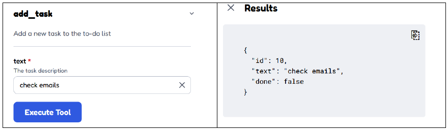
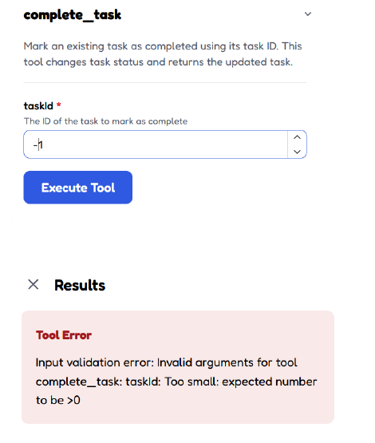
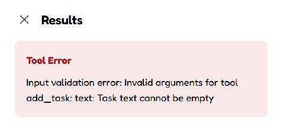

# Week 5 — Test Plan

| id    | tool          | setup                                            | input                                                 | expected                                                           | result | evidence |
| ----- | ------------- | ------------------------------------------------ | ----------------------------------------------------- | ------------------------------------------------------------------ | ------ | -------- |
| TC-01 | add_task      | Reset `data/todos.json` to the test fixture      | `examples/add_task.json`                              | A new task is added successfully                                   | PASS   | Happy path screenshot |
| TC-02 | add_task      | Reset `data/todos.json` to the test fixture      | Empty task text                                       | The request is rejected with a short validation error              | PASS   | Empty/error screenshot |
| TC-03 | list_tasks    | Reset `data/todos.json` with test tasks          | `examples/list_tasks.json`                            | The task list is returned successfully                             | PASS   | Test screenshot |
| TC-04 | list_tasks    | Reset `data/todos.json` with test tasks          | Invalid input                                         | The request is rejected with a short validation error              | PASS   | Validation rejection screenshot |
| TC-05 | complete_task | Reset `data/todos.json` with an incomplete task  | `examples/complete_task.json`                         | The selected task is marked as completed                           | PASS   | Test screenshot |
| TC-06 | complete_task | Reset `data/todos.json` with test tasks          | Invalid task ID                                       | The request is rejected with a short validation error              | PASS   | Validation rejection screenshot |
| TC-07 | list_tasks    | Set `data/todos.json` to an empty task list      | `list_tasks` with empty data                          | An empty list is returned without crashing                         | PASS   | Empty list screenshot |
| TC-08 | add_task      | Reset `data/todos.json` to the test fixture      | Task text longer than the allowed limit               | The request is rejected with a validation error                    | PASS   | Validation screenshot |
| TC-09 | complete_task | Reset `data/todos.json` to the test fixture      | Task ID that does not exist                           | A controlled error is returned                                     | PASS   | Error screenshot |
| TC-10 | list_tasks    | Simulate an unavailable or timed-out data source | Run `list_tasks` while the data source is unavailable | A short controlled error is returned and the server does not crash | PASS   | Error screenshot |

## Fixture Reset

Before tests that change the data, reset `data/todos.json` to the original test fixture.

## Test Summary

All 10 test cases were executed in MCP Inspector.

- All test cases passed on the first run.
- No code fixes were required.
- No test cases failed.
- Screenshots were captured for the required happy path, validation rejection, and empty/error cases.

## Failures and Fixes

No failures were found during testing. All test cases passed on the first run.

## Later

None. No new ideas came up during testing.

## Evidence

### TC-01 — Happy Path

Successful `add_task` call.

### TC-06 — Validation Rejection

Invalid task ID rejected by validation.

### TC-02 — Empty / Error Case

Empty task text rejected with a controlled validation error.

